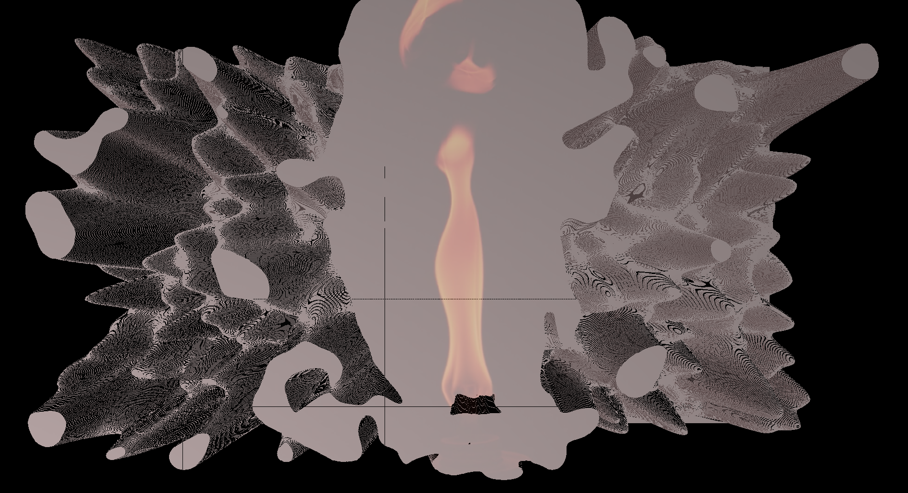

# Horn Schunke Optical Flow simulated with a Particle Engine using CUDA/OpenGL InterOp.



#### Theory
[Determining Optical Flow](http://image.diku.dk/imagecanon/material/HornSchunckOptical_Flow.pdf)

#### Performance Stats
1. Final render: __3840x2160x12 @ 37 fps__ on an Nvidia 1060 GTX GPU assembled on a Surface Book Pro 2 

#### Demo:
You can find the coolest state of the project [here on Vimeo](https://vimeo.com/408605423).

#### Dependencies:

1. [CMake v3.8+](https://cmake.org/download/) [for CUDA support within CMake]
2. [CUDA v9.0+](https://developer.nvidia.com/cuda-92-download-archive) 
3. [OpenCV 4.3.0](https://github.com/opencv/opencv/archive/4.3.0.tar.gz) [for reading images and webcam]
4. [GLFW](https://github.com/glfw/glfw)
5. [GLEW](https://github.com/nigels-com/glew/archive/glew-2.1.0.tar.gz) (Only Windows)
6. [GLM](https://github.com/g-truc/glm/archive/0.9.9.8.tar.gz)

#### Installation:

1. Let `$PROJECT_ROOT` be the root directory of the project.
2. Download an example video from [here](https://drive.google.com/open?id=1gg7qESE4TFNfjMmYdOnTzwgEwnnZV7UT) and place it in `$PROJECT_ROOT/src/resources`.
3. After installing the dependencies please follow the cmake build steps in the code block below.
4. After the binary has been compiled, place it in `$PROJECT_ROOT/src` directory.
5. Run `.\particle_atractor`

```cmake
cd $PROJECT_ROOT
mkdir build
cd build
cmake ..
make -j4
```

#### Roadmap:

- [x] CUDA based particle engine.
  - [x] Event system for Mouse, Keyboard and Window
  - [x] Object file reader
  - [x] Shader code parser
  - [x] Rendering Engine
  - [x] Instanced Rendering for "pixel" objects
  - [x] Materials and Lighting (Specular, Ambient and Diffuse)
- [x] Simulate gravity using CUDA OpenGL Interop.
- [x] Integrating OpenCV with the particle engine to render frames captured from the video file.
- [x] CUDA Kernel for ~LK~ HS based velocity vector computation.
  - [x] Central difference approximation
  - [x] HK convolution
- [x] Update particle engine physics to simulate ~Hooke's Law~ Gradient descent.
- [x] Navier Stokes based CFD Physics.
  - [x] 2D advection
  - [x] 2D Diffusion
  - [x] Cavity Flow
