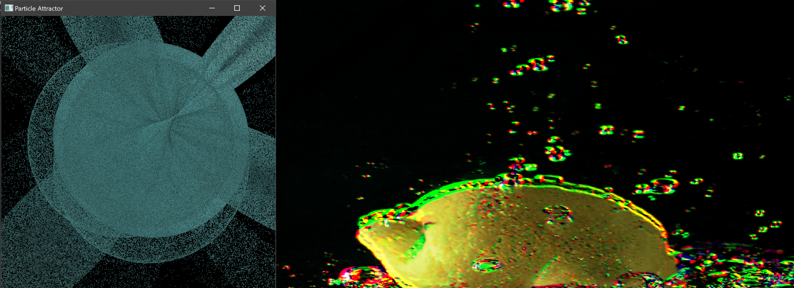

# particle_attractor
My experiment with particle physics in C++14 and OpenGL 4.4 ..
Check out branch: cuda_interop for high volume render.

##### Road Map
- [x] Renderer
- [x] Objects
- [x] GLFW Window
- [ ] ImGUI integration
- [x] Instancing 
- [x] CUDA Kernel for particle updates
- [x] Render 10\*9 particles using CUDA interop
- [ ] Bloom
- [ ] Optical flow kernel
- [ ] Bind texture with particles
- [ ] Update particle velocities with Optical Flow  
